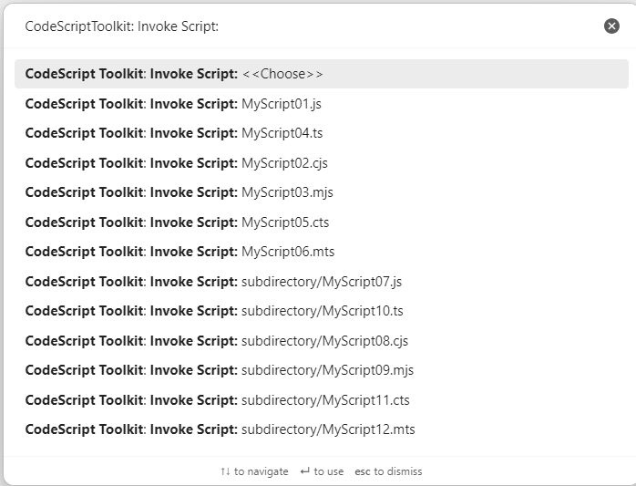
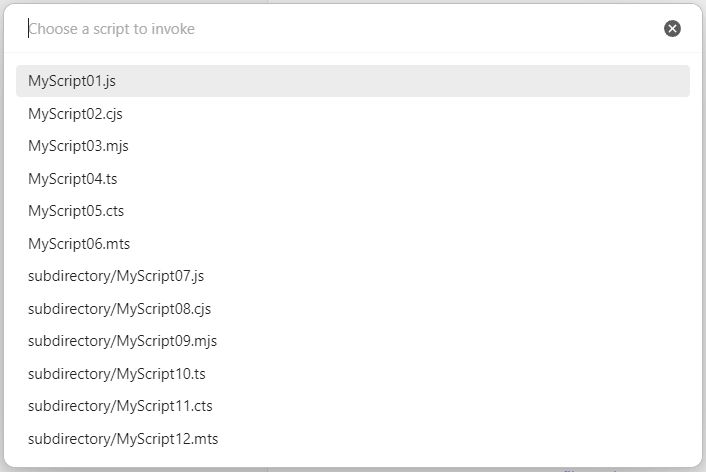

# CodeScript Toolkit

(formerly known as `Fix Require Modules`, see [Rebranding](#rebranding) section for more details)

This is a plugin for [`Obsidian`][Obsidian] that allows to do a lot of things with [`JavaScript`][JavaScript]/[`TypeScript`][TypeScript] scripts from inside the [`Obsidian`][Obsidian] itself.

## Who is this plugin for?

This plugin is for you if you want to:

- Write in any flavor of [`JavaScript`][JavaScript]/[`TypeScript`][TypeScript] in:
  - [DevTools Console](https://developer.chrome.com/docs/devtools/console) within [`Obsidian`][Obsidian];
  - [CustomJS](https://github.com/saml-dev/obsidian-custom-js) scripts;
  - [dataviewjs](https://blacksmithgu.github.io/obsidian-dataview/api/intro/) scripts;
  - [Modules](https://github.com/polyipseity/obsidian-modules) scripts;
  - [QuickAdd](https://quickadd.obsidian.guide/) scripts;
  - [Templater](https://silentvoid13.github.io/Templater/) scripts;
  - etc.
- Write modular scripts using modern [`JavaScript`][JavaScript]/[`TypeScript`][TypeScript] syntax and patterns.
- Prototype [`Obsidian`][Obsidian] plugins.
- Explore [`Obsidian`][Obsidian] API (public and internal) in runtime easier.
- Invoke any [`JavaScript`][JavaScript]/[`TypeScript`][TypeScript] script via command or hotkey.

## Why this plugin?

There are several very good plugins that allow to write [`JavaScript`][JavaScript]/[`TypeScript`][TypeScript] scripts for [`Obsidian`][Obsidian], but they all have their own limitations and quirks.

Most of those plugins support writing scripts in [`CommonJS` (`cjs`)][cjs] only, which is not so used nowadays.

None of those plugins provide you the developer experience as you would have in any other modern [`JavaScript`][JavaScript]/[`TypeScript`][TypeScript] development environment.

This plugin aims to erase the line between the [`Obsidian`][Obsidian] world and the [`JavaScript`][JavaScript]/[`TypeScript`][TypeScript] development world.

## New functions

The plugin adds the following functions to the global scope:

```js
require(id);
require(id, options);

await requireAsync(id);
await requireAsync(id, options);

await requireAsyncWrapper((require) => {
  // any code that uses synchronous require()
});
await requireAsyncWrapper(async (require) => {
  // any code that uses synchronous require()
});
```

```ts
id: string;
options: Partial<RequireOptions>;

interface RequireOptions {
  cacheInvalidationMode: 'always' | 'never' | 'whenPossible';
  parentPath: string;
}
```

Explanation of the options will be shown in the [Features](#features) section.

### `require()`

[`Obsidian`][Obsidian] on desktop has a built-in [`require()`][require] function, but it is quite limited.

[`Obsidian`][Obsidian] on mobile does not have it at all.

This plugin brings the advanced version of [`require()`][require] to both desktop and mobile.

### `requireAsync()`

Combines all features of [`require()`][require] and [`import()`][import].

All features brought by this plugin are available for it.

### `requireAsyncWrapper()`

Wraps synchronous `require()` calls in asynchronous ones.

It is useful when you want to use the synchronous `require()` calls but some features are not available for it normally.

```js
await requireAsyncWrapper((require) => {
  require(anyFeature);
});
```

It is especially useful for migrating scripts you have for desktop to use on mobile, as you can see in the [Features](#features) section, most of the features of `require()` don't work on mobile.

## Features

All of the examples below will be shown using `require()`, but you can use them with all the new functions introduced by this plugin.

### Built-in Modules

|                      | Desktop | Mobile |
| -------------------- | ------- | ------ |
| **`require()`**      | ✔       | ✔      |
| **`requireAsync()`** | ✔       | ✔      |

Certain [`Obsidian`][Obsidian] built-in modules are available for import during plugin development but show `Uncaught Error: Cannot find module` if you try to [`require()`][require] them manually. This plugin fixes that problem, allowing the following [`require()`][require] calls to work properly:

```js
require('obsidian');
require('@codemirror/autocomplete');
require('@codemirror/collab');
require('@codemirror/commands');
require('@codemirror/language');
require('@codemirror/lint');
require('@codemirror/search');
require('@codemirror/state');
require('@codemirror/text');
require('@codemirror/view');
require('@lezer/common');
require('@lezer/lr');
require('@lezer/highlight');
```

Example usage:

```js
const obsidian = require('obsidian');
new obsidian.Notice('My notice');

const { Notice } = require('obsidian');
new Notice('My notice');
```

### `obsidian/app` module

|                      | Desktop | Mobile |
| -------------------- | ------- | ------ |
| **`require()`**      | ✔       | ✔      |
| **`requireAsync()`** | ✔       | ✔      |

There is a global variable `app` that gives access to [`Obsidian`][Obsidian] [`App`][App] instance.

However, starting from [`Obsidian`][Obsidian] [`v1.3.5`](https://github.com/obsidianmd/obsidian-api/commit/7646586acccf76f877b64111b2398938acc1d53e#diff-0eaea5db2513fdc5fe65d534d3591db5b577fe376925187c8a624124632b7466R4708) this global variable is deprecated in the public API.

Starting from [`Obsidian`][Obsidian] [`v1.6.6`](https://github.com/obsidianmd/obsidian-api/commit/f20b17e38ccf12a8d7f62231255cb0608436dfbf#diff-0eaea5db2513fdc5fe65d534d3591db5b577fe376925187c8a624124632b7466L4950-L4959) this global variable was completely removed from the public API.

Currently this global variable is still available, but it's better not rely on it, as it is not guaranteed to be maintained.

This plugin gives you a safer alternative:

```js
require('obsidian/app');
```

### `obsidian/builtInModuleNames` module

|                      | Desktop | Mobile |
| -------------------- | ------- | ------ |
| **`require()`**      | ✔       | ✔      |
| **`requireAsync()`** | ✔       | ✔      |

You can access the list of built-in [`Obsidian`][Obsidian] module names that are made available by this plugin.

```js
require('obsidian/builtInModuleNames');
```

### Relative path

|                      | Desktop | Mobile |
| -------------------- | ------- | ------ |
| **`require()`**      | ✔       | ✖      |
| **`requireAsync()`** | ✔       | ✔      |

Fixes `Cannot find module` errors for relative paths:

```js
require('./some/relative/path.js');
require('../some/other/relative/path.js');
```

Optionally provide the path to the current script/note if detection fails. Submit an [issue](https://github.com/mnaoumov/obsidian-codescript-toolkit/issues) if needed:

```js
require('./some/relative/path.js', { parentPath: 'path/to/current/script.js' });
require('./some/relative/path.js', { parentPath: 'path/to/current/note.md' });
```

### Root-relative path

|                      | Desktop | Mobile |
| -------------------- | ------- | ------ |
| **`require()`**      | ✔       | ✖      |
| **`requireAsync()`** | ✔       | ✔      |

Adds support for root-relative paths:

```js
require('/path/from/root.js');
```

The root `/` directory is configurable via settings.

### System root path (Linux, MacOS)

|                      | Desktop | Mobile |
| -------------------- | ------- | ------ |
| **`require()`**      | ✔       | ✖      |
| **`requireAsync()`** | ✔       | ✔      |

On Linux and MacOS, the system root path is `/path/from/system/root.js`.

In order to distinguish them from [root-relative path](#root-relative-path), you need to prepend `~` to the path.

```js
require('~/path/from/system/root.js');
```

### Vault-root-relative path

|                      | Desktop | Mobile |
| -------------------- | ------- | ------ |
| **`require()`**      | ✔       | ✖      |
| **`requireAsync()`** | ✔       | ✔      |

Adds support for vault-root-relative paths:

```js
require('//path/from/vault/root.js');
```

### [`ECMAScript Modules` (`esm`)](https://nodejs.org/api/esm.html)

|                      | Desktop | Mobile |
| -------------------- | ------- | ------ |
| **`require()`**      | ✔       | ✖      |
| **`requireAsync()`** | ✔       | ✔      |

Originally, [`require()`][require] only supported [`CommonJS` (`cjs`)][cjs] modules and would throw `require() of ES Module path/to/script.mjs not supported. Instead change the require of path/to/script.mjs to a dynamic import() which is available in all CommonJS modules`. This plugin adds support for ECMAScript modules:

```js
require('path/to/script.mjs');
```

Now you can use any type of JavaScript modules:

```js
require('path/to/script.js');
require('path/to/script.cjs');
require('path/to/script.mjs');
```

### [`TypeScript`][TypeScript] modules

|                      | Desktop | Mobile |
| -------------------- | ------- | ------ |
| **`require()`**      | ✔       | ✖      |
| **`requireAsync()`** | ✔       | ✔      |

Adds support for [`TypeScript`][TypeScript] modules:

```js
require('path/to/script.ts');
require('path/to/script.cts');
require('path/to/script.mts');
```

> [!WARNING]
>
> When the plugin loads a [`TypeScript`][TypeScript] module, it strips all type annotations and convert the code into [`JavaScript`][JavaScript] syntax.
>
> The plugin will report an error only if the code is syntactically incorrect. No type-checking is performed, as it done by IDEs and/or compilers.
>
> So you can potentially load some non-compilable [`TypeScript`][TypeScript] module, and the plugin won't report any errors. You can get runtime errors when using the module.
>
> It is advisable to validate your [`TypeScript`][TypeScript] modules with external IDEs and/or compilers.
>
> Example of such problematic module:
>
> ```ts
> interface Foo {
>   bar: string;
> }
>
> export function printFoo(foo: Foo): void {
>   console.log(foo.barWithTypo); // this line would cause a compilation error in a regular IDE, but the plugin won't report any errors
> }
> ```
>
> The plugin just strips all type annotations and converts the code into [`JavaScript`][JavaScript]:
>
> ```js
> export function printFoo(foo) {
>   console.log(foo.barWithTypo);
> }
> ```
>
> So when we execute within [`Obsidian`][Obsidian]:
>
> ```js
> require('/FooModule.ts').printFoo({ bar: 'baz' });
> ```
>
> we get `undefined` instead of `baz`.

### NPM modules

|                      | Desktop | Mobile |
| -------------------- | ------- | ------ |
| **`require()`**      | ✔       | ✖      |
| **`requireAsync()`** | ✔       | ✔      |

You can require NPM modules installed into your configured scripts root folder.

```js
require('npm-package-name');
```

See [Tips](#tips) how to avoid performance issues.

### URLs

|                      | Desktop | Mobile |
| -------------------- | ------- | ------ |
| **`require()`**      | ✖       | ✖      |
| **`requireAsync()`** | ✔       | ✔      |

```js
require('https://some-site.com/some-script.js');
```

### File URLs

|                      | Desktop | Mobile |
| -------------------- | ------- | ------ |
| **`require()`**      | ✔       | ✖      |
| **`requireAsync()`** | ✔       | ✔      |

You can require files using file URLs:

```js
require('file:///C:/path/to/vault/then/to/script.js');
```

### Resource URLs

|                      | Desktop | Mobile |
| -------------------- | ------- | ------ |
| **`require()`**      | ✔       | ✖      |
| **`requireAsync()`** | ✔       | ✔      |

You can require files using resource URLs:

```js
require(
  'app://obsidian-resource-path-prefix/C:/path/to/vault/then/to/script.js'
);
```

See [getResourcePath()](https://docs.obsidian.md/Reference/TypeScript+API/Vault/getResourcePath) and [Platform.resourcePathPrefix](https://docs.obsidian.md/Reference/TypeScript+API/Platform#resourcePathPrefix) for more details.

### Top-level await

|                      | Desktop | Mobile |
| -------------------- | ------- | ------ |
| **`require()`**      | ✖       | ✖      |
| **`requireAsync()`** | ✔       | ✔      |

```js
await Promise.resolve();

export const dep = 42;
```

### Smart caching

|                      | Desktop | Mobile |
| -------------------- | ------- | ------ |
| **`require()`**      | ✔       | ✔      |
| **`requireAsync()`** | ✔       | ✔      |

Modules are cached for performance, but the cache is invalidated if the script or its dependencies change.

You can also control cache invalidation mode:

```js
require('./someScript.js', { cacheInvalidationMode: 'always' });
require('./someScript.js', { cacheInvalidationMode: 'never' });
require('./someScript.js', { cacheInvalidationMode: 'whenPossible' });
```

- `always` - always get the latest version of the module, ignoring the cached version
- `never` - always use the cached version, ignoring the changes in the module, if any
- `whenPossible` - get the latest version of the module if possible, otherwise use the cached version

Also, you can use a query string to skip cache invalidation (except for URLs), which behaves as setting `cacheInvalidationMode` to `never`:

```js
require('./someScript.js?someQuery'); // cacheInvalidationMode: 'never'
require('https://some-site.com/some-script.js?someQuery'); // cacheInvalidationMode: 'whenPossible'
```

### Clear cache

| Desktop | Mobile |
| ------- | ------ |
| ✔       | ✔      |

If you need to clear the `require` cache, you can invoke the `CodeScript Toolkit: Clear Cache` command.

### Source maps

| Desktop | Mobile |
| ------- | ------ |
| ✔       | ✔      |

Manages source maps for compiled code, allowing seamless debugging in [`Obsidian`][Obsidian].

### Invocable scripts

| Desktop | Mobile |
| ------- | ------ |
| ✔       | ✔      |

Make any script invocable by defining a module that exports a function named `invoke` (sync or async) that accepts `app` argument of [`App`][App] type.

```ts
// cjs sync
exports.invoke = (app) => {
  console.log('cjs sync');
};

// cjs async
exports.invoke = async (app) => {
  console.log('cjs async');
  await Promise.resolve();
};

// mjs sync
export function invoke(app) {
  console.log('mjs sync');
}

// mjs async
export async function invoke(app) {
  console.log('mjs async');
  await Promise.resolve();
}

// cts sync
import type { App } from 'obsidian';
exports.invoke = (app: App): void => {
  console.log('cts sync');
};

// cts async
import type { App } from 'obsidian';
exports.invoke = async (app: App): Promise<void> => {
  console.log('cts async');
  await Promise.resolve();
};

// mts sync
import type { App } from 'obsidian';
export function invoke(app: App): void {
  console.log('mts sync');
}

// mts async
import type { App } from 'obsidian';
export async function invoke(app: App): Promise<void> {
  console.log('mts async');
  await Promise.resolve();
}
```

### Invoke scripts

| Desktop | Mobile |
| ------- | ------ |
| ✔       | ✔      |

Configure a script directory so every script in it can be invoked using the [`Command Palette`][Command Palette]. Use `CodeScript Toolkit: Invoke Script: <<Choose>>` for more predictable lists:





### Startup script

| Desktop | Mobile |
| ------- | ------ |
| ✔       | ✔      |

Invoke any script when [`Obsidian`][Obsidian] loads via a configuration setting.

You can add an optional `cleanup()` function to the startup script, which will be called when the plugin is unloaded.

The function has the same signature as [`invoke()`](#invocable-scripts) function.

```ts
import type { App } from 'obsidian';

export async function cleanup(app: App): Promise<void> {
  // executes when the plugin is unloaded
}

export async function invoke(app: App): Promise<void> {
  // executes when the plugin is loaded, including when the app is started
}
```

You can reload the startup script using the `CodeScript Toolkit: Reload Startup Script` command.

### Hotkeys

| Desktop | Mobile |
| ------- | ------ |
| ✔       | ✖      |

Assign hotkeys to frequently used scripts:


### Code buttons

| Desktop | Mobile |
| ------- | ------ |
| ✔       | ✔      |

Create code buttons that execute [`JavaScript`][JavaScript]/[`TypeScript`][TypeScript]:

````markdown
```code-button "Click me!"
// CommonJS (cjs) style
const { dependency1 } = require('./path/to/script1.js');

// ES Modules (esm) style
import { dependency2 } from './path/to/script2.js';

// Top-level await
await Promise.resolve(42);

// TypeScript syntax
function myTypeScriptFn(arg: string): void {}
```
````


If you don't want to see the system messages such as `Executing...`, `Executed successfully`, you can set the `systemMessages` setting to `false`.

````markdown
```code-button "Click me!" systemMessages:false
// code
```
````

### Refreshing code blocks

| Desktop | Mobile |
| ------- | ------ |
| ✔       | ✔      |

Code blocks are refreshed automatically when the content changes.

If you just update settings in the code block header, the code block will not be rerendered.

So your button caption and settings will not be refreshed.

To fix that, you can:

- Modify the code block content.
- Reopen the note.
- Reload the plugin.
- Use the [Refresh Preview](https://obsidian.md/plugins?id=refresh-preview) plugin.

### Console messages

| Desktop | Mobile |
| ------- | ------ |
| ✔       | ✔      |

Code blocks intercept all calls to `console.debug()`, `console.error()`, `console.info()`, `console.log()`, `console.warn()` and display them in the results panel.

````markdown
```code-button "Console messages"
console.debug('debug message');
console.error('error message');
console.info('info message');
console.log('log message');
console.warn('warn message');
```
````


If you do not want to intercept console messages, you can set the `console` setting to `false`.

````markdown
```code-button "Console messages" console:false
// code
```
````

See [Refreshing code blocks](#refreshing-code-blocks).

### Auto output

| Desktop | Mobile |
| ------- | ------ |
| ✔       | ✖      |

Code blocks automatically output the last evaluated expression.

````markdown
```code-button REPL
1 + 2;
3 + 4;
5 + 6; // this will be displayed in the results panel
```
````

To disable this feature, set the `autoOutput` setting to `false`.

````markdown
```code-button REPL autoOutput:false
1 + 2;
3 + 4;
5 + 6; // this will NOT be displayed in the results panel
```
````

See [Refreshing code blocks](#refreshing-code-blocks).

### Auto running code blocks

| Desktop | Mobile |
| ------- | ------ |
| ✔       | ✖      |

Code blocks can be configured to run automatically when the note is opened using the `autorun` or `autorun:true` setting.

````markdown
```code-button "Run automatically" autorun
// code to run
```
````

See [Refreshing code blocks](#refreshing-code-blocks).

### Container

| Desktop | Mobile |
| ------- | ------ |
| ✔       | ✖      |

Within code block you have access to the `container` HTML element that wraps the results panel.

````markdown
```code-button "Using container"
container.createEl('button', { text: 'Click me!' });
```
````

### Render markdown

| Desktop | Mobile |
| ------- | ------ |
| ✔       | ✖      |

Within code block you have access to the `renderMarkdown()` function that renders markdown in the results panel.

````markdown
```code-button "Render markdown"
await renderMarkdown('**Hello, world!**');
```
````

### Temp plugins

| Desktop | Mobile |
| ------- | ------ |
| ✔       | ✔      |

This plugin allows you to create temporary plugins.

This is useful for quick plugin prototyping from inside the [`Obsidian`][Obsidian] itself.

The key here is the function `registerTempPlugin()`, which is available in the script scope.

````markdown
```code-button "Click me!"
import { Plugin } from 'obsidian';

class MyPlugin extends Plugin {
  onload() {
    console.log('loading MyPlugin');
  }
}

registerTempPlugin(MyPlugin);
```
````

The loaded temp plugins can be unloaded using the `CodeScript Toolkit: Unload Temp Plugin: PluginName` / `CodeScript Toolkit: Unload Temp Plugins` commands.

Also all temp plugins are unloaded when current plugin is unloaded.

## Tips

| Desktop | Mobile |
| ------- | ------ |
| ✔       | ✔      |

If you plan to use scripts extensively, consider putting them in a [`dot directory`][dot directory], such as `.scripts` within your vault. [`Obsidian`][Obsidian] doesn't track changes within [`dot directories`][dot directory] and won't re-index your `node_modules` folder repeatedly.

## Limitations

### Extending [`import()`][import]

| Desktop | Mobile |
| ------- | ------ |
| ✔       | ✔      |

Extending dynamic [`import()`][import] expressions to support `const obsidian = await import('obsidian')` is currently impossible due to [`Electron`](https://www.electronjs.org/) limitations within [`Obsidian`][Obsidian]. Although [`Obsidian`][Obsidian] [`1.6.5+`](https://obsidian.md/changelog/2024-06-25-desktop-v1.6.5/) uses [`Node.js v20.14.0`](https://nodejs.org/en/blog/release/v20.14.0) which includes [`Module.register()`][Module Register], it depends on [`Node.js Worker threads`](https://nodejs.org/api/worker_threads.html) and fails with `The V8 platform used by this instance of Node does not support creating Workers`. Use [`requireAsync()`](#requireAsync) as a workaround.

## Installation

- The plugin is available in [the official Community Plugins repository](https://obsidian.md/plugins?id=fix-require-modules).
- [Beta releases](obsidian://brat?plugin=https://github.com/mnaoumov/obsidian-codescript-toolkit) can be installed via [BRAT](https://obsidian.md/plugins?id=obsidian42-brat).

## Debugging

By default, debug messages for this plugin are hidden.

To show them, run the following command:

```js
window.DEBUG.enable('fix-require-modules');
```

For more details, refer to the [documentation](https://github.com/mnaoumov/obsidian-dev-utils?tab=readme-ov-file#debugging).

## Rebranding

This plugin was formerly known as `Fix Require Modules`.

The plugin quickly overgrew its original purpose and got way more features than just fixing `require()` calls. That's why it got a new name.

However, for the backward compatibility, the previous id `fix-require-modules` is still used internally and you might find it

- in plugin folder name;
- in plugin URL;
- in [Debugging](#debugging) section;

## Support

<a href="https://www.buymeacoffee.com/mnaoumov" target="_blank"></a>

## License

© [Michael Naumov](https://github.com/mnaoumov/)

[App]: https://docs.obsidian.md/Reference/TypeScript+API/App
[cjs]: https://nodejs.org/api/modules.html#modules-commonjs-modules
[Command Palette]: https://help.obsidian.md/Plugins/Command+palette
[dot directory]: https://en.wikipedia.org/wiki/Hidden_file_and_hidden_directory#Unix_and_Unix-like_environments
[import]: https://developer.mozilla.org/en-US/docs/Web/JavaScript/Reference/Statements/import
[JavaScript]: https://developer.mozilla.org/en-US/docs/Web/JavaScript
[Module Register]: https://nodejs.org/api/module.html#moduleregisterspecifier-parenturl-options
[Obsidian]: https://obsidian.md/
[require]: https://nodejs.org/api/modules.html#requireid
[TypeScript]: https://www.typescriptlang.org/
